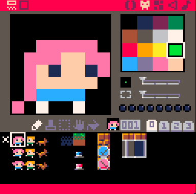

### Instructions for your Game-Making Quest

Welcome, you are tasked with making your own video game!
The road ahead will be challenging and dangerous; take this guide with you!

+++

### Introduction


To start making your game, you need to access the game editor. To do this, press <kbd>Esc</kbd> twice. 

+++

You should see this at the top  of your screen: 
. 
If you don't see `-- i am a comment`, make sure the correct symbol and tab are selected like in the picture.

+++

```lua
-- i am a comment
function _init()
	t = 0
	
	-- level 1
	start = false

	-- level 2
	title = "untitled"
	t_color = 2
end


function _update()
 	t = t + .015  -- increase time
 
 	-- level 3

end


function _draw()
	cls()  --clears the screen
	print(title, 64, 48, t_color)
	
	-- level 3

end
```
@[1](At the top you should see this line)
@[1](These are called **Comments**. Computers don't read those, they're there as notes for the programmer.)
@[2-11](In most video games, code has three parts. Let's start with the first one which is **\_init()**)
@[2-11](This is where you put settings for when the game starts for the first time. It only runs  **one time at the beginning of the game.**)
@[14-30](The other two parts don't just run once, they run over and over again like a loop! They make up what's called the **Game Loop.**)
@[14-30](Let's talk about that later, first we need to figure out how to start our game! We'll need to change the code a bit to do that.🙂) 

+++

### Level 1

> **_Tip:_** to reload your game after making a change, use the keyboard shortcut <kbd>Ctrl</kbd> + <kbd>R</kbd>

+++

```lua
-- i am a comment
function _init()
	t = 0
	
	-- level 1
	start = false

	-- level 2
	title = "untitled"
	t_color = 2
```
@[3](That's a **variable.**)
@[3](It's just something that holds a value, like a box. What it holds can _vary_, hence vary..able!)
@[3](Our game is using the `t` variable to track how much time has passed. Right now, `t` contains 0. We'll leave that alone for now.)
@[6](Variables can also hold **booleans**. A boolean is just something that is `true` or `false`.)
@[6](The value of our `start` variable won't let our game begin.)
@[6](Right now it's `false`, so change it to the opposite of false.)
@[6](Once you've done that, reload your game with <kbd>Ctrl</kbd> + <kbd>R</kbd> and see if it worked!)

+++

### Level 2

> **_Tip:_** want to make someone's day? Shout "REGINALD!"

+++

```lua
-- i am a comment
function _init()
	t = 0
	
	-- level 1
	start = false

	-- level 2
	title = "untitled"
	t_color = 2
```
@[4](Awesome, looks like our game is working!)
@[4](Right now the title is just "untitled" and it's kind of an ugly color too 😕. Let's change that!)
@[4](Variables can also hold strings of letters and characters called ... **strings**! In PICO-8, strings are surrounded with quotation marks " ") 
@[9](Look! In the code there's a variable named `title` with the string `"untitled"` in it.)
@[9](Go ahead and change it to a *cooler* name.)
@[9](Got it? Let's reload our game using <kbd>Ctrl</kbd> + <kbd>R</kbd> to see it in all its glory!)

+++

Oh wait, we forgot to change that ugly color!

Variables can hold **strings** and **booleans**, but they can also hold **numbers**! Just like that `t` variable earlier.

+++

```lua
	-- level 1
	start = false

	-- level 2
	title = "untitled"
	t_color = 2
	
	-- level 3
	character = 0
```

@[6](Notice that the `t_color` variable has a number in it.)
@[6](That number 2 is one of PICO-8's 16 colors to choose from.)
@[6](Check out the cheatsheet in front of you and let's change that to a color you like!)
@[6](Let's **reload** it using <kbd>Ctrl</kbd> + <kbd>R</kbd> and cross our fingers it works. )


+++

### Level 3

> **_Tip:_** shoutout to Dr. Yousou Zou. He inspired me to pursue political science.

+++

Now that looks nice!

In games, we have characters running around doing stuff. Let's get a character on to our game now too!

+++

To see the list of characters available, click this icon on the upper-right corner of your screen.


You should see the following screen after clicking the icon.




+++

Now, you need to get the number of the character you want. 

To do this, click on the character and then near the middle of the screen you should see its number like so


The number indicated is the one we need. In the image above, the number of the character is 1.

+++

```lua
	-- level 2
	title = "untitled"
	t_color = 2
	
	-- level 3
	character = 0
	
end
--once you finish your changes
--press ctrl+r to reload your
--game.
```

@[6](Now, let's change the value of the character variable with the number of the character we chose.)
@[6](Got it? Let's **reload** it using <kbd>Ctrl</kbd> + <kbd>R</kbd> to see our changes.)
@[6](and we have a character!.. but wait... it doesn't move.)

+++

How do we make our character move? Well, we can by adding a *conditional*. This is where you could make your character *do something* if a condition is true.

+++

```lua
--press ctrl+r to reload your
--game.

-->8
function _update()
 t = t + .015  -- increase time
 
 -- level 3
 

end
```
@[5-11](Since this will be part of how your game works, we have to put it inside **\_update()**)
@[5-11](This part of the code is part of the **Game Loop** that we talked about earlier that runs multiple times per second.)

+++

> **_Tip:_** The **Game Loop** in PICO-8 runs 30 times per second!

+++

Now, let's make our character move.

A basic conditional statement we could start with is the **if...then** How this works is kinda like...

```lua

if "I get A's" is True then "parents are happy!"
   (condition)                  (action)

 ```

+++

You can see in the example given that we have a *condition* and an *action*. 

If the **condition** is met, then the **action** happens. 

+++

```lua

if btn(left) then
	move(left)
end
```
@[1](To make our character move, we'll have to make a conditional that checks if a button is pressed.)
@[2](If it is pressed,)
@[3](then we move!)
@[3](Wait what does `move` do? And what is that inside the parenthesis?)
@[3](`move` here is what you call a *function* and inside that parenthesis is a *parameter*.)
@[3](You can tell a **function** to do something. In this case, you call the function to `move` and tell it to move `left`.)

+++

### Level 4

> **_Tip:_** My mama always said liveCoding's like a box of chocolates. You never know what you're gonna sound like.
