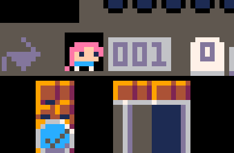

# **Welcome!**
*Instructions for your Game-Making Quest*

+++

You are tasked with making your own video game!

The road ahead will be challenging and dangerous.  |

Take this guide with you!  |

+++

### Introduction


To start making your game, you need to access the game editor. To do this, press <kbd>Esc</kbd> twice. 

+++

You should see this at the top  of your screen: 
  
If you don't see `-- i am a comment`, make sure the correct symbol and tab are selected like in the picture.

+++

```lua
-- i am a comment
function _init()
	t = 0
	
	-- level 1
	start = false

	-- level 2
	title = "untitled"
	t_color = 2
end
```
@[1](At the top you should see this line)
@[1](These are called **Comments**. Computers don't read those, they're there as notes for the programmer.)
@[2, 11](In most video games, code has three parts. Let's start with the first one which is **`_init`**. We've put `_init` in tab 0)
@[3-10](`_init` is where you put settings for when the game starts for the first time. It only runs  **one time at the beginning of the game.**)
@[4](The other two parts are in tab 1 and tab 2. They don't just run once, they run over and over again in a loop! They make up what's called the **Game Loop.**)
@[4](Let's talk about that later, first we need to figure out how to start our game! We'll need to change the code a bit to do that.🙂) 

+++

### Level 1

> **_Tip:_** to reload your game after making a change, use the keyboard shortcut <kbd>Ctrl</kbd> + <kbd>R</kbd>

+++

```lua
-- i am a comment
function _init()
	t = 0
	
	-- level 1
	start = false

	-- level 2
	title = "untitled"
	t_color = 2
```
@[3](That's a **variable.**)
@[3](It's just something that holds a value, like a box. What it holds can _vary_, hence vary..able!)
@[3](Our game is using the `t` variable to track how much time has passed. Right now, `t` contains 0. We'll leave that alone for now.)
@[6](Variables can also hold **booleans**. A boolean is just something that is `true` or `false`.)
@[6](The value of our `start` variable won't let our game begin.)
@[6](Right now it's `false`, so change it to the opposite of false.)
@[6](Once you've done that, reload your game with <kbd>Ctrl</kbd> + <kbd>R</kbd> and see if it worked!)

+++

### Level 2

> **_Tip:_** want to make someone's day? Shout "REGINALD!"

+++

```lua
-- i am a comment
function _init()
	t = 0
	
	-- level 1
	start = false

	-- level 2
	title = "untitled"
	t_color = 2
```
@[4](Awesome, looks like our game is working!)
@[4](Right now the title is just "untitled" and it's kind of an ugly color too 😕. Let's change that!)
@[4](Variables can also hold strings of letters and characters called ... **strings**! In PICO-8, strings are surrounded with quotation marks " ") 
@[9](Look! In the code there's a variable named `title` with the string `"untitled"` in it.)
@[9](Go ahead and change it to a *cooler* name.)
@[9](Got it? Let's reload our game using <kbd>Ctrl</kbd> + <kbd>R</kbd> to see it in all its glory!)

+++

Oh wait, we forgot to change that ugly color!

Variables can hold **strings** and **booleans**, but they can also hold **numbers**! Just like that `t` variable earlier.

+++

```lua
	-- level 1
	start = false

	-- level 2
	title = "untitled"
	t_color = 2
	
	-- level 3
	character = 0
```

@[6](Notice that the `t_color` variable has a number in it.)
@[6](That number 2 is one of PICO-8's 16 colors to choose from.)
@[6](Check out the cheatsheet in front of you and let's change that to a color you like!)
@[6](Let's **reload** it using <kbd>Ctrl</kbd> + <kbd>R</kbd> and cross our fingers it works. )


+++

### Level 3

> **_Tip:_** shoutout to Dr. Yousou Zou. He inspired me to pursue political science.

+++

Now that looks nice!

In games, we have characters running around doing stuff. Let's get a character on to our game now too!

+++

To see the characters we have drawn, click the second icon on the top-right 


You are now on the art screen, it should look like this:


+++

Now, let's choose a character!

Once you click one of them, you'll see the character number here:



The number indicated is the one we'll put in the code. In the image above, the number of the character is 1.

+++

```lua
	-- level 2
	title = "untitled"
	t_color = 2
	
	-- level 3
	character = 0
	
end
--once you finish your changes
--press ctrl+r to reload your
--game.
```

@[6](Now, let's change the value of the character variable to the number of the character we chose.)
@[6](Got it? Next, we need to draw your character on the screen!)

+++

To draw the character, you need to use **functions**.
You can tell a function to do something. In this case, you call the function named `draw_player()` to draw your character on the screen.

+++

```lua
function _draw()
	cls()  --clears the screen
	print(title, 64, 48, t_color)
	
	-- level 3
	-- draw map here
	-- draw player here

end
```
@[1-9](Since `draw_player()` draws your character on the screen, let's put it inside **\_draw()**. \_draw() is one of the three parts of the game loop we were talking about earlier. It is in tab 2.)
@[7](Make sure to draw your player here using the `draw_player()` function.)
@[7](All done? Let's reload our game using <kbd>Ctrl</kbd> + <kbd>R</kbd> to see our character!)

+++

Now, we need to have a place for our character to live in!

We can make that using the `draw_map()` function.

Since the `draw_map()` draws something, we also need to put it inside **\_draw()** which is on tab 2.

+++

```lua
function _draw()
	cls()  --clears the screen
	print(title, 64, 48, t_color)
	
	-- level 3
	-- draw map here
	-- draw player here
end
```
@[6](Make sure to draw the map here using the `draw_map()` function.)
@[6](All done? Let's reload our game using <kbd>Ctrl</kbd> + <kbd>R</kbd> to see our map!)

+++

We have a problem, our character is just floating in the air. 

That's because we haven't put physics into our game yet. We could use the `update_physics` function to do this!


+++
```lua
function _update()
 t = t + .015  -- increase time
 
 -- level 3
 -- update physics here
 
end
```
@[1-7](Since we're *updating* the state of the game, we have to put `update_physics` inside **\_update()** which is on tab 1.)
@[1-7](\_update() is one of the three parts of the game loop. We now know the three parts, **\_init()**, **\_update()**, and **\_draw()**)
@[5](Make sure to update the physics here using the `update_physics()` function.)
@[5](Got it? Let's reload our game using <kbd>Ctrl</kbd> + <kbd>R</kbd> to see our character in motion!)

+++

> **_Tip:_** The **Game Loop** in PICO-8 runs 30 times per second!

+++

Now, let's make our character move.

To make our character move, we could use the `move()` function. 

But! The computer has to know the direction we want our character to go. We can specify this as a *parameter* to our function like so:

`move(right)`

+++

However, we don't want to move right all the time, so we need to use a **conditional**.

A basic conditional statement we could start with is the **if...then** How this works is kinda like...

```lua

if "I get A's" is True then "parents are happy!"
   (condition)                  (action)

 ```

+++

You can see in the example given that we have a *condition* and an *action*. 

If the **condition** is met, then the **action** happens. 

+++

We want our character to move right if we're pressing the right arrow button. We could use the btn() function for this like so:

`btn(right)`

+++

```lua
if ButtonIsPressed then
	MoveCharacter
end
```

@[1-3](Copy the code above inside **\_update()** and replace `ButtonIsPressed` and `MoveCharacter` with the right functions and parameters. Use `btn()` and `move()`.)
@[1-3](Copy the code above inside **\_update()** again for the other direction(left))

+++

```lua
function _update()
 t = t + .015  -- increase time
 
 -- level 3
 -- update physics here
 -- put left conditional here
 -- put right conditional here

end
```
@[6-9](After you're done copying the conditionals here, reload the game using <kbd>Ctrl</kbd> + <kbd>R</kbd> and see if you can make your character move using the arrow keys!)

+++

### Level 4

> **_Tip:_** My mama always said liveCoding's like a box of chocolates. You never know what you're gonna sound like.

+++

Almost there! If you can get through that door, you win!

+++

To open that door we will need to flip a switch. However, the switch is not on the screen so we have to draw it first.

+++

To draw it, we have to use the `draw_switch(location)` function but we have to specify where to draw it first so we have to replace *location* with a number between *0 to 127*.

+++

```lua
function _draw()
	cls()  --clears the screen
	print(title, 64, 48, t_color)
	
	-- level 3
	-- draw map here
	-- draw player here
	-- draw switch here
end
```
@[1-9](Since `draw_switch(location)` draws something on the screen, we need to put it inside **\_draw()**.)
@[8](Put your `draw_switch(location)` function here but make sure to replace *location* with a number from 0 to 127)

+++

Now, we need to setup a conditional that turns on the switch when we press the <kbd>z</kbd> key.

It should look like the conditional we made earlier like so:

```lua
if (btn(Button)) then
	hit_switch()
end
```
@[1](Make sure to replace *Button* with the key we have to press to turn on the switch(in this case it's the <kbd>z</kbd> key.))

+++

```lua
function _update()
 t = t + .015  -- increase time
 
 -- level 3
 -- update physics here
 -- put left conditional here
 -- put right conditional here
 -- put flip switch conditional here
end
```
@[1-11](Since we will be *updating* the switch, we need to put it inside **\_update()**.)
@[9](Put your conditional here.)
@[9](Let's reload the game using <kbd>Ctrl</kbd> + <kbd>R</kbd> and flip on the switch using the <kbd>Z</kbd> key!)

+++

The door is now open, but there is a gap between the door and the bridge. To get to the door, we must cover the gap with blocks!

+++

To do this we need to use the `build_bridge()` function. 

However, this time you have to *make* the build_bridge() function.

+++

Inside the build_bridge function we have to write a **loop**

A loop repeats over and over again. We will use a loop because we have to draw a block *over and over again* depending on how many blocks are missing on the bridge.

+++

A loop looks like this: 

```lua
  for i=1, 10 do
        add_tile()
  end
```
@[1](This loop repeats 10 times as you can see in the first line.)
@[1](However, we need it to repeat depending on how many blocks there are.)
@[1](To do this, we have to replace 10 with how many blocks are missing on the bridge.)
@[1](There's a variable called `floor_missing` that contains the number of how many blocks are missing. You can use this variable instead of 10.)

+++

```
function build_bridge()
	-- put your loop here
end
```
@[1-3](This is how your `build_bridge()` will look like.)
@[2](Make sure to put your loop here from the previous slide.)

+++

```lua
-- i am a comment
function _init()
	t = 0
	
	-- level 1
	start = false

	-- level 2
	title = "untitled"
	t_color = 2

	-- level 3
	character = 0
	
end

-- put your build_bridge() function here

```
@[17](When you're done making your `build_bridge()` function, put it here.)

+++

```lua
-- i am a comment
function _init()
    t = 0
    
    -- level 1
    start = true

    -- level 2
    title = "game"
    t_color = 11
    
    -- level 3
    character = 3
    
    -- level 4
    -- call build_bridge() here
    
end
```
@[16](Now we've finished writing `build_bridge()`, we have to call it here.)
@[16](When you're done, let's press <kbd>Ctrl</kbd> + <kbd>R</kbd> and watch our bridge come to form!)

+++

This is the time we've been waiting for, go ahead and go through that door! :D
